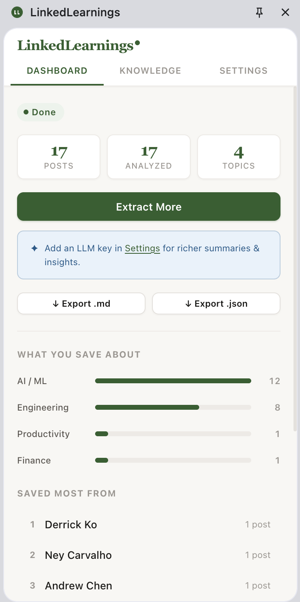
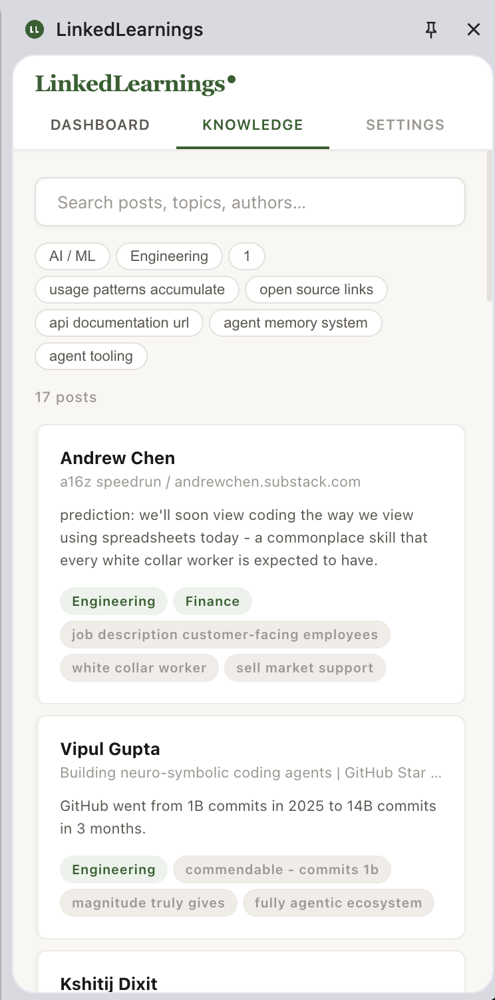

<p align="center">
  
</p>

<h1 align="center">LinkedLearnings</h1>

<p align="center">
  <strong>Your LinkedIn saved posts are a graveyard. This brings them back to life.</strong>
</p>

<p align="center">
  A Chrome extension that extracts your saved LinkedIn posts, analyzes them, and builds a searchable personal knowledge base. Entirely in your browser.
</p>

<p align="center">
  <a href="#installation">Install</a>&nbsp;&nbsp;&bull;&nbsp;&nbsp;<a href="#how-it-works">How it works</a>&nbsp;&nbsp;&bull;&nbsp;&nbsp;<a href="#llm-setup">LLM setup</a>&nbsp;&nbsp;&bull;&nbsp;&nbsp;<a href="#architecture">Architecture</a>&nbsp;&nbsp;&bull;&nbsp;&nbsp;<a href="#contributing">Contributing</a>
</p>

---

<p align="center">
  
  &nbsp;&nbsp;&nbsp;&nbsp;
  
</p>

<p align="center">
  <em>Left: Dashboard with topic distribution and top authors. Right: Knowledge base with search, tags, and post cards.</em>
</p>

---

## The problem

You've saved hundreds of LinkedIn posts over the years. Career advice, technical insights, industry takes, hiring signals. They're all sitting in a flat, unsearchable list on LinkedIn that you never revisit.

LinkedLearnings fixes this. It scrolls through your saved posts with human-like behavior, extracts the content, categorizes everything, and gives you a searchable knowledge base right in your browser sidebar.

**No API keys required.** Deterministic analysis (keyword extraction, category mapping, engagement scoring) works instantly, offline, with zero configuration. Add an LLM key later if you want richer summaries and insights.

## How it works

```
Save posts on LinkedIn → Extract with one click → Instant analysis → Searchable knowledge base
```

1. **Extract.** Click "Start Extraction" and a tab opens to your saved posts. The extension scrolls through them with randomized delays, variable scroll distances, and batch pauses to mimic natural browsing. Posts are deduplicated and written to IndexedDB in real time.

2. **Analyze (instant, no API key).** RAKE keyword extraction, fixed-tag category mapping across 12 categories, text signal detection (hiring, announcement, tip, story), engagement tier scoring, and first-sentence summaries. Runs locally in milliseconds.

3. **Enhance with LLM (optional).** Bring your own API key for any provider. The extension batches 10 posts per API call with rate-limit-aware retries, designed to work well even with free-tier models.

4. **Browse and export.** Search by keyword, filter by tag, browse by author. Export to Markdown or JSON.

## What you get

**Extraction that doesn't get you flagged.** The extension scrolls like a human. Variable distances (250-700px), randomized pauses between batches, automatic detection of CAPTCHAs and rate limits with graceful pause-and-resume. You can minimize the tab and keep working.

**Analysis that works offline, instantly.** Every post gets categorized across 12 topics, tagged with RAKE-extracted keywords, scored by engagement tier, and linked to related posts. All deterministic, zero network calls. No API key. No waiting.

**LLM enhancement when you want it.** Plug in any provider: OpenAI, Anthropic, Groq, Ollama (fully local), OpenRouter, or any OpenAI-compatible endpoint. The prompts are tuned for cheap and free-tier models. Deterministic results are never overwritten, only enriched.

**A knowledge base, not a list.** Search by keyword, filter by tag, browse by author. See what topics you actually care about (the dashboard might surprise you). Export everything to Markdown or JSON.

**Your data never leaves your browser.** Posts, analysis, and settings live in IndexedDB and `chrome.storage.local`. The only outbound call is to the LLM provider you configure, and that's optional.

## Installation

1. Clone this repository
   ```bash
   git clone https://github.com/viktrum/linkedlearnings.git
   ```
2. Open `chrome://extensions/` in Chrome
3. Enable **Developer mode** (top-right toggle)
4. Click **Load unpacked** and select the `linkedlearnings/` folder
5. The LinkedLearnings icon appears in your toolbar

## LLM setup

> LinkedLearnings works fully without an LLM. This section is optional.

| Provider | Config | Cost estimate (500 posts) |
|----------|--------|--------------------------|
| **OpenAI** | API key + `gpt-4o-mini` | ~$0.30 |
| **Anthropic** | API key + `claude-sonnet-4-20250514` | ~$5 |
| **Groq** | API key + `llama-3.1-70b-versatile` | Free tier available |
| **Ollama** | Local install, `ollama serve` | Free, fully private |
| **OpenRouter** | API key + any model | Free models available |

The Settings tab has one-click model chips for free OpenRouter models. Pick one, paste your key, done.

## Permissions

| Permission | Why |
|-----------|-----|
| `sidePanel` | The knowledge base UI |
| `tabGroups` | Groups the extraction tab out of your way |
| `tabs` | Opens and manages the LinkedIn tab |
| `storage` | Saves settings locally |
| `alarms` | Keeps the service worker alive during extraction |
| `scripting` | Injects the extraction script into LinkedIn |
| `host: linkedin.com` | Reads your saved posts page |

LLM API permissions are requested **only when you configure a provider**.

## Privacy

- All data lives in your browser's IndexedDB. Nothing is sent anywhere.
- API keys are stored in `chrome.storage.local` (standard Chrome extension model). They never leave your browser except when calling your chosen LLM.
- No telemetry. No analytics. No tracking. No external calls besides the LLM you configure.
- For complete privacy, use Ollama. Everything runs locally.

## Architecture

```
linkedlearnings/
├── background/
│   └── service-worker.js      # Orchestration, tab/group management, messaging
├── content/
│   ├── extractor.js           # LinkedIn page scrolling and post extraction
│   └── selectors.js           # DOM selectors (update here if LinkedIn changes)
├── lib/
│   ├── analysis.js            # Deterministic engine (RAKE, fixed tags, signals)
│   ├── pipeline.js            # 3-phase pipeline: deterministic → LLM → related
│   ├── prompts.js             # LLM prompt templates
│   ├── llm.js                 # Provider abstraction (OpenAI, Anthropic, etc.)
│   ├── db.js                  # IndexedDB wrapper
│   └── export.js              # Markdown and JSON export
├── sidepanel/
│   ├── panel.html             # HTML shell
│   ├── app.js                 # UI state machine (dashboard/knowledge/settings)
│   └── styles.css             # Design system
└── manifest.json
```

## Contributing

Contributions welcome. The most impactful areas:

- **`content/selectors.js`** is where LinkedIn DOM selectors live. If extraction breaks after a LinkedIn update, this is the file to fix.
- **`lib/analysis.js`** is the deterministic analysis engine. Improve keyword extraction or add categories here.
- **`lib/prompts.js`** has the LLM prompts. Better prompts = better knowledge extraction.
- **`lib/llm.js`** is the provider abstraction. Add new LLM providers here.

## Disclaimer

This tool interacts with LinkedIn's web interface to extract your own saved posts. While it mimics natural browsing behavior, automated interaction with LinkedIn may violate their Terms of Service. **Use at your own risk.** The authors are not responsible for any account restrictions.

## License

MIT
